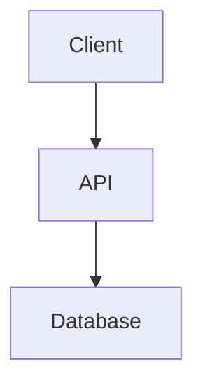

# Diagram Maker

## When to use
User asks to draw/create an architecture diagram, flowchart, sequence diagram, ER diagram, or any visual structure representation.

## How to use

### Mermaid (首选 — 零依赖)
Generate Mermaid code and render online:


### D2 (如已安装)
```bash
echo 'x -> y' | d2 - > /tmp/diagram.png
```

### ASCII fallback
If no tools available, output ASCII art diagrams in code blocks.
