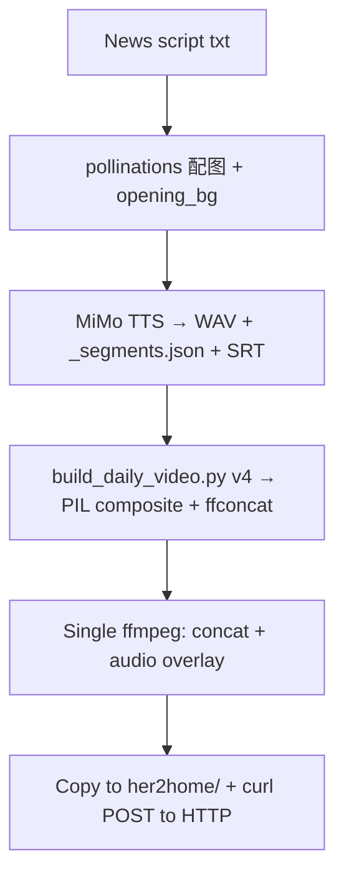

# Signal Pop News Video Pipeline

Two approaches exist for generating video content. **Prefer Google Flow (2026)** — it's free, higher quality, and simpler to operate.

---

## Approach A: Google Flow + Veo 3.1 (Recommended, 2026)

**Cost: $0.** No API keys, no infrastructure, no ffmpeg.

Google Flow (labs.google/fx/tools/flow) is a unified AI creative studio that bundles video generation, image generation, and editing — all free with a Google account.

### Tools inside Flow

| Tool | Purpose | Free tier |
|------|---------|-----------|
| **Veo 3.1** | Video generation with native audio (dialogue + lip-sync + SFX + music) | 20 credits/clip (Fast) |
| **Nano Banana** | Image generation, character consistency, precise editing | Included in Flow |
| **Gemini Omni** | Multimodal input, conversational editing, script generation | Included in Flow |

### Free Credits
- 100 starter + 50 daily credits
- Veo 3.1 Fast = 20 credits → **2–3 clips/day free**
- Veo 3.1 Lite = 10 credits → **5 clips/day free**
- 1080p upscale: free; 4K upscale: 50 credits
- **No watermark** on free tier

### Clip limits
- Single generation: 4–8 seconds
- Extend via chaining (7s hops × up to 20) → ~148 seconds (~2.5 min)
- Quality degrades after 3–5 hops; plan accordingly

### Workflow for Signal Pop

1. **Plan + script via Gemini Omni** — Gemini Omni is the multimodal hub inside Flow. Feed it reference images, video clips, or text prompts. Use it to plan visual direction and generate narration script.
2. **Create character reference via Nano Banana** — Generate subject‑consistent images (presenter/avatar/scene). Output serves as **reference image** for Veo.
3. **Seed Veo 3.1 with reference images** — Upload Nano Banana output as the starting image for Veo 3.1. This gives character consistency across clips. Prompt describes motion/dialogue from the script segment.
4. **Extend/chain** clips for longer segments (7s hops, ≤20 hops)
5. **Dialogue lip-sync** — Veo 3.1 generates native audio from text prompt. Script text in the prompt → synchronized speech.
6. **Download** 720p/1080p output

### Limitations
- Single clip ≤ 8s (need chaining for longer)
- Custom audio upload not supported (use Flow's native audio)
- Requires Google account; no programmatic API (web UI only)
- No direct API for automated pipeline — human-in-loop for now

### Access
- URL: https://labs.google/fx/tools/flow
- Sign in with any Google account (free)
- Region-locked? Check FAQ at labs.google/fx/tools/flow/faq

---

## Approach B: Legacy Free-Asset Pipeline (Deprecated)

The original Pexels + MoviePy pipeline has been **superseded** by Approach A. Kept here for reference.

> The user switched to audio-only (MP3 + text script) as of 2026-05-13. See **`signal-pop-audio-only-pipeline`** for the current working configuration.

### Prerequisites
- Python 3.11+ with `pip`.
- Internet access for RSS feeds and Pexels API (optional).
- **Optional**: `ffmpeg`/`ffprobe` for real video assembly. If unavailable, the pipeline falls back to a placeholder silent audio and an empty MP4.

### Project Structure
```
signal_pop_project/
├─ src/
│  ├─ fetch_news.py          # RSS fetch & 48h filter (fixed feedparser attribute)
│  ├─ filter_news.py         # Keyword scoring filter
│  ├─ generate_script.py     # Offline script generator (no LLM API required)
│  ├─ match_assets.py        # Pexels search, downloads clips/images
│  ├─ tts.py                 # Generates silent placeholder audio via pydub
│  ├─ assemble_video.py      # Creates placeholder MP4 (fallback when ffmpeg missing)
│  └─ upload.py              # Stub upload metadata
├─ assets/
│  ├─ clips/   (downloaded video clips)
│  ├─ images/  (downloaded images)
│  └─ audio/   (combined.wav created by tts.py)
├─ data/
│  ├─ raw_feed.json
│  ├─ filtered_news.json
│  ├─ script.txt
│  └─ final.mp4
├─ scripts/run_all.sh        # Orchestrates the whole pipeline
├─ docs/signal_pop_architecture.html  # Architecture diagram (generated)
└─ requirements.txt
```

### Common Pitfalls (Legacy)
- **Missing `published_parsed` attribute** – fixed by patching `fetch_news.py`.
- **OpenAI/Large‑model API key not set** – replaced LLM call with offline generator.
- **`ffmpeg` not installed** – `assemble_video.py` now falls back to creating an empty MP4 so the pipeline never aborts.
- **Pexels API quota** – limit to one result per headline; failures are logged but do not stop the pipeline.

## Approach C: Full‑Screen News Broadcast Video (2026-07-05, v4 ✅ CURRENT)

**When to use**: You have a spoken-format news script + custom per-item images (from `signal-pop-image-generation` skill). Generate TTS audio, then compose a news-broadcast-style video where **each image is the full-screen background** with text overlaid on a left-side gradient mask — matching the July 1 reference video style.

**Cost: $0.** MiMo TTS free tier + ffmpeg + PIL + Noto Sans CJK. Fully automatable via cron.

### Layout (v4, 2026-07-14 updated)

| Element | Opening card | Each news slide (×10) | Ending card |
|---------|-------------|----------------------|-------------|
| Background | Separate studio image (`opening_bg.jpg`, prompt "新闻播报直播间", full-bleed, darkened) | News image for that item (full-bleed) | Same as opening |
| Top line | Gold horizontal rule | — | Gold horizontal rule |
| Emblem | Gold circle (outer ring + filled dot) | — | Gold circle |
| Title | **隔天信号弹** (gold, 72px, bold) | — | **隔天信号弹** (64px) |
| Subtitle | 每日新闻播报 | — | 下期见 |
| Date/info | YYYY年MM月DD日 · N条新闻 | — | Date only |
| Intro text overlay | 3-line spoken intro (36px, center-bottom, shadow) MUST be drawn | — | — |
| Tag badge | — | **国内民生** (blue pill) + **#01** at upper-left | — |
| News title | — | Bold white, 46px, wrapped at 2-3 lines | — |
| Body text | — | Grey-white 24px, 3-4 lines on left gradient mask | — |
| Footer | — | L: `隔天信号弹 · YYYY.MM.DD` | — |
| Page | — | R: `N/10` | — |
| Base overlay | Global 160α dark + bottom gradient | Left gradient (0→200α over 1300px) + bottom fade | Global 180α dark |

### Workflow



### ⚠️ IMAGE-GEN CRON MISSES LATE DRAFTS (live pitfall, 2026-07-09)
`cron: signal-pop-daily-images` (周日/二/四/五 09:30) runs `gen_news_images.py`, which uses `date.today()` to pick `img_YYYYMMDD/`. If the news draft lands in `archive/` AFTER 09:30 (real case: draft written 10:26), the cron already ran and will NOT backfill. **Fix**: run the image-gen manually for that date — the script skips any `>1KB` existing jpg, so re-running is safe. Verify `img_YYYYMMDD/01..10.jpg` + `opening_bg.jpg` exist before TTS.

### ⚠️ DATE IS HARDCODED IN build_daily_video.py (live pitfall, 2026-07-09)
`scripts/build_daily_video.py` top line `DATE = "YYYYMMDD"` is **hardcoded, no CLI arg**. You MUST edit it to the prep date before running:
```bash
sed -i 's/^DATE = .*/DATE = "20260709"/' scripts/build_daily_video.py
python3 scripts/build_daily_video.py
```
The build auto-copies OUTPUT to `/home/kan/shared/her2home/video_YYYYMMDD.mp4` + `cover_YYYYMMDD.png`. PUB_DATE = DATE+1 computed inside.

### ⚠️ CROSS-MACHINE HTTP POST IS PERMISSION-GATED (live pitfall, 2026-07-09)
`curl -X POST -F "file=@..." http://10.10.10.30:8080/her2home/` is a cross-box POST the agent cannot auto-run without user consent (blocked at runtime). Local her2home copy is done by the build script already; the HTTP upload can be left for the user to confirm or triggered via a consented command.

### Steps

1. **Parse spoken script** from `archive/signal_pop_daily_YYYYMMDD.txt`. Each item is a **2-line block** separated by blank lines. **DO NOT** regex on single lines — see Parse Pitfalls below.

2. **Generate opening/ending background** — Pollinations with prompt "新闻播报直播间", save as `opening_bg.jpg` in the img directory. Must be visually different from news images.

3. **TTS** via MiMo (`src/tts_mimo.py`, `xiaoxiao` female for daily, `yunyang` male for weekly). Output: WAV + SRT + **`_segments.json`** (per-segment real durations, consumed by build step).
   - **CLI**: `python3 src/tts_mimo.py "$(cat archive/signal_pop_daily_YYYYMMDD.txt)" --female --output output/daily/signal_pop_daily_YYYYMMDD --srt output/daily/signal_pop_daily_YYYYMMDD.srt`
   - **Pass raw text via `$(cat ...)`** — the script reads the first argument as text, not a file path.
   - **API key**: NOT in env by default. Read from `/home/kan/shared/OpenMontage/signal_pop_test/.mimo_key` and `export MIMO_API_KEY="$(cat /home/kan/shared/OpenMontage/signal_pop_test/.mimo_key)"` first, or calls 401.
   - **Output path takes NO extension**: the script appends `.wav` itself AND writes the durations JSON as `signal_pop_daily_YYYYMMDD_segments.json` (NOT `durations.json`). Build step reads `_segments.json`. If you pass `--output ...wav`, the script still strips/forces `.wav` but the JSON is always `_segments.json`.

4. **Composite frames with PIL** (1920×1080):
   - **Opening**: `opening_bg.jpg` as full-bleed background → darken (RGBA overlay, 160α) → gold title overlay → **intro text overlay** (3 lines, 36px, center-bottom, see pitfall below). **Never use solid color background** — user requires image.
   - **News slides**: Each image as full-bleed background → **RGBA gradient overlay** (see CRITICAL: Alpha Gradient Bug below) → overlay text. Text region starts at x=60.
   - **Ending**: same as opening, with "下期见" subtitle. (User rule: closing text MUST be "下期见", NOT "明天见" — not published daily.)

- **AV-sync**: build step reads `_segments.json` (actual TTS per-segment durations). Last news segment borrows 3.0s for ending card. `ffprobe` should show video duration ≈ audio duration (within 0.5s).

6. **Create ffconcat file**: `ffconcat version 1.0` header, then `file 'path.png'\nduration N.N` per frame. No intermediate MP4 encoding needed — single-pass concat ~10× faster.

7. **Single ffmpeg encode**: concat images + WAV overlay → output MP4. Use `-preset veryfast -crf 24`.

### Font Requirements

```python
# WRONG — DejaVu Sans → □ tofu boxes:
ImageFont.truetype("DejaVuSans.ttf", 48)

# WRONG — PIL emoji → □ square:
draw.text((960, 380), "📡", ...)  # PIL cannot render emoji

# CORRECT:
FONT = "/usr/share/fonts/opentype/noto/NotoSansCJK-Regular.ttc"
FONT_BOLD = "/usr/share/fonts/opentype/noto/NotoSansCJK-Bold.ttc"
FONT_MEDIUM = "/usr/share/fonts/opentype/noto/NotoSansCJK-Medium.ttc"
```

### Key Script Paths

| Component | Path |
|-----------|------|
| Build script | `/home/kan/signal_pop/scripts/build_daily_video.py` |
| Image gen | `<project>/scripts/gen_custom_images.py` (if exists) |
| Image source | Pollinations: `image.pollinations.ai/prompt/{q}?width=1024&height=576&seed=N&model=flux&nofeed=true` |

### Parse Pitfalls

News script items span **two lines** separated by a blank line:
```
第1条，国内新闻。全国多地进入三伏天，气象台发布高温预警及防暑降温提醒。
据新华网报道，随着夏季气温攀升...（新华网）。
```

**WRONG**: `re.findall(r'…(.*?据[^。]+。)', text)` — fails because:
- Body starts on next line, not same line.
- "据" appears in titles too ("大促数据", "经济数据") → false body start.

**CORRECT**: split on blank lines (`\n\s*\n`), take `lines[0]` for category+title (`rest[:first_period]` = category, `rest[first_period+1:]` = title), join `lines[1:]` as body.

### ⚠️ CRITICAL: Opening Card MUST Include Spoken Intro Text Overlay (2026-07-14)

**Problem**: `draw_opening()` only rendered brand title ("隔天信号弹") + date. The TTS read the intro ("这里是隔天信号弹，今天是…") but the visual card had NO text — user saw brand title for 8s while TTS played the intro, then it cut to news slides.

**Fix** — two parts:

1. **Add text overlay** to `draw_opening()` — the spoken intro must be drawn:
```python
intro_lines = [
    "这里是隔天信号弹，",
    f"今天是{PUB_DATE_FMT}，{PUB_WEEKDAY}。",
    f"欢迎收看本期信号弹，"
    f"以下是本期精选的{len(news_items)}条核心新闻。",
]
y_text = 665
for line in intro_lines:
    for ox, oy in [(-1,0),(1,0),(0,-1),(0,1),(-1,-1),(1,1)]:
        draw.text((960+ox, y_text+oy), line, fill=(0,0,0,80), font=fnt(36), anchor="mm")
    draw.text((960, y_text), line, fill=(240, 240, 250), font=fnt(36), anchor="mm")
    y_text += 46
```

2. **Font size trap**: 26px is INVISIBLE on 1920×1080. The first fix attempt failed because 26px was too small — user couldn't see it. Use **36px minimum** for overlay text on opening card.

### ⚠️ Timing Fallback When segments.json Has Fewer Entries Than Expected (2026-07-14)

**Problem**: `segments.json` may have only 9 entries (intro + 8 segments) when there are 10 news items. Old code had two branches:
- `len(seg_durations) >= len(news_items) + 1` → use real durations
- `else` → hardcoded intro=8s, proportional rest

This meant 9-entry JSON fell into `else`, giving opening card only 8s while TTS intro was actually 24.6s. **User heard intro but card vanished after 8s** — the user perceived this as "no spoken opening, straight to news" because the card cut before the intro finished. This is the #1 root cause of "没有开场白" complaints.

**Diagnosis**: When user says "没有开场白 / no opening", first check:
1. Does the TTS audio have intro? Check `_segments.json` — `seg_durations[0]` value vs `intro_dur` in the build log. If seg_durations[0] ≈ 24s but intro_dur = 8s, the timing fallback is wrong.
2. Does the opening card have visual text? Check `fnt(26)` vs `fnt(36)` — 26px is invisible on 1920×1080.
3. Verify the concat file: `cat /tmp/concat_v4.txt | head -5` — first frame duration should match TTS seg_durations[0].

**Fix**: Add third branch `elif seg_durations:` that uses real intro duration even when segments are too few:
```python
elif seg_durations:
    # Has intro segment but not enough for all news
    with wave.open(AUDIO, 'rb') as w:
        total_dur = w.getnframes() / w.getframerate()
    intro_dur = seg_durations[0]  # real intro duration
    outro_dur = 6.0
    news_chars = [len(t)+len(b) for _,t,b in news_items]
    news_total = total_dur - intro_dur - outro_dur
    news_durs = [news_total * c / sum(news_chars) for c in news_chars]
```

### ⚠️ CRITICAL: Alpha Gradient Bug (v3→v4, Novice Trap)

**Problem**: `draw.rectangle(fill=(0,0,0,α))` on an **RGB image** ignores the alpha channel entirely because RGB has no alpha plane. Result: solid black rectangle, not a transparent gradient. This caused both "开场只显示一半黑" and "配图断层" in v3.

```python
# WRONG — alpha silently dropped:
img = Image.new('RGB', (1920, 1080))
draw = ImageDraw.Draw(img)
for x in range(1300):
    draw.rectangle([x, 0, x, 1080], fill=(0,0,0,int(200*(1-x/1300))))

# CORRECT — RGBA overlay then composite:
overlay = Image.new('RGBA', (1920, 1080), (0,0,0,0))
draw = ImageDraw.Draw(overlay)
for x in range(1300):
    a = int(255 * (1 - x/1300))
    draw.rectangle([x, 0, x, 1080], fill=(0,0,0,a))
bg = bg.convert('RGBA')
bg = Image.alpha_composite(bg, overlay).convert('RGB')
```

**Rule of thumb**: Never draw semi-transparent shapes on RGB. Always prepare as RGBA layer then `alpha_composite()`.

### ⚠️ Date Convention: Publication Date = Prep Date + 1

**Rule**: News scripts prepared on Sun/Tue/Thu/Fri 09:00 are published on Mon/Wed/Fri/Sat. The video MUST show the **publication date**, not the preparation date.

**Implementation** (`build_daily_video.py`):
```python
DATE = "20260705"  # prep date (file naming)
from datetime import datetime, timedelta
PUB_DT = datetime.strptime(DATE, "%Y%m%d") + timedelta(days=1)
PUB_DATE = PUB_DT.strftime("%Y%m%d")
PUB_DATE_FMT = f"{PUB_DATE[:4]}年{PUB_DATE[4:6]}月{PUB_DATE[6:8]}日"
PUB_DATE_SHORT = f"{PUB_DATE[:4]}.{PUB_DATE[4:6]}.{PUB_DATE[6:8]}"
PUB_WEEKDAY = ['星期一','星期二','星期三','星期四','星期五','星期六','星期日'][PUB_DT.weekday()]
```

Use `PUB_DATE_FMT` / `PUB_DATE_SHORT` / `PUB_WEEKDAY` for all video display text (opening, footer, ending). Keep `DATE` for file paths (IMG_DIR, AUDIO, NEWS_FILE).

**News intro text** must also match publication date: `"这里是隔天信号弹，今天是{PUB_DATE_FMT}，{PUB_WEEKDAY}。"`

### ⚠️ Content Verification: Political Titles & Proper Nouns

**Pitfall**: In 2026, Trump is the sitting US president. The news script called him "前总统特朗普" (former president) — a factual error that must be caught before video assembly. For current politics, this type of error damages credibility.

**Checklist before video build**:
1. **Current-office titles**: Verify any "前/former" prefix on office titles — is this person still in office?
2. **Proper noun check**: Named entities (President, CEO, leader, secretary) must reflect current reality
3. **Date-sensitive identifiers**: "现任" / "前任" / current vs. former — these rot with time. Always cross-reference the current holder.
4. **Source verification**: Foreign news sources (Sky News Australia in this case) may use outdated descriptors. Default to up-to-date title.

**No automated fix** — the news script comes from an upstream process. The video builder should flag suspicious patterns (`前.*总统|former.*[Pp]resident|前.*长|前.*主席`) and present them for user review.

### ⚠️ Audio-Video Sync (TTS Duration Matching)

**Problem**: Estimating frame duration by character proportion causes drift (v3 issue). The ending card text transitioned before the TTS finished speaking.

**Fix**: Record actual per-segment WAV durations from TTS:
```python
# In tts_mimo.py synthesize_long_text():
for segment in text_segments:
    raw_wav = api_request(segment)
    durations.append(len(raw_wav) / 24000)  # real duration
return audio, durations, srt_segments

# In build script, read _segments.json:
durations = json.load(open('signal_pop_daily_YYYYMMDD_segments.json'))
# Frame N duration = durations[N], last frame gets durations[N] - 3.0 (borrowed by ending card)
```

**Verify**: `ffprobe` should show video duration ≈ audio duration (within 0.5s).

### Text Readability on Bright Backgrounds

Full-bleed images with bright sections make white text hard to read. Two-layer defense:
1. **Left gradient**: α=255 at left edge, tapering to 0 by x=960 (faster drop) then α=60→0 over x=960-1920 (shallower slope)
2. **9-direction text shadow**: Draw text at ±1,±2 pixel offset in dark grey before main white text. Not a single offset — use 9 renders around the text position for full halation.

### Image Sources & Reliability

| Source | Endpoint | Status |
|--------|----------|--------|
| Pollinations | `image.pollinations.ai/prompt/…` | ⚠️ Unstable — 403, 500, timeouts common. Needs `&nofeed=true` + `User-Agent` header. Poor face rendering. |
| Mixkit | `assets.mixkit.co/videos/{id}/{id}-720.mp4` | ✅ Reliable, real photos/videos. Need search API first. |

### v4 vs v3 vs v2 vs v1

| Version | Style | Status |
|---------|-------|--------|
| v1 (2026-07-01) | Full-bleed images, NO text overlay | ❌ Deprecated |
| v2 (2026-07-05, earlier) | Dark solid bg + RIGHT INSET image (700×550) + text | ❌ User rejected: image too small, no opening bg |
| v3 (2026-07-05, intermediate) | Full-bleed image bg + left gradient + text overlay | ⚠️ Had alpha black bug + AV sync drift |
| **v4 (2026-07-05, current)** | **Full-bleed bg + separate opening studio bg + RGBA gradient overlay + actual TTS durations + intro overlay text** | ✅ **CORRECT** — all prior issues fixed |

### Legacy (Approach C v2 — DO NOT USE)

The v2 style (dark solid background + right inset thumbnail image) was **rejected by the user**. Key complaints:
1. Opening card had no background image → "只有文字没有图片"
2. News images were small insets → "配图不能缩成小图"
3. Face distortion in Pollinations images → "脸部有变形"
4. No ending card → "需要结尾图"
5. Body text missing (parser was wrong) → "每条新闻没有配文字稿"

All resolved in v3. Do NOT re-introduce v2 layout.

# References
- Google Flow landing: https://labs.google/fx/tools/flow
- Veo 3.1 model: https://deepmind.google/models/veo/
- Nano Banana (Gemini Image): https://deepmind.google/models/gemini-image/
- Google Flow FAQ: https://labs.google/fx/tools/flow/faq
- **v3 Full‑Screen Layout (current)** — `references/v3-fullscreen-layout-20260705.md` (this skill)
- **逐条定制配图模板** — `references/tailored-img-gen-template.py` (this skill) — 每条新闻独立场景 prompt，避免重复赛博隧道/数据中心风
- **多平台自动分发** — `multi-platform-video-publishing` skill (devops)
- **social-auto-upload 项目** — `/home/kan/shared/social-auto-upload/`
- ⚠️ HyperFrames (`references/hyperframes-evaluation-2026.md`) is DEPRECATED — `/home/kan/signal_pop/hyperframes` no longer exists; rendering is `build_daily_video.py` v4. Do not follow HyperFrames steps.

---

## 多平台自动分发（完整管线的最后一步）

视频生成（Approach A 或 B）完成后，产出文件：
```
/home/kan/signal_pop/daily/output/signal_pop_daily_YYYYMMDD.mp4
/home/kan/signal_pop/daily/output/cover_YYYYMMDD.png
```

### 1. 准备分发文件（按 social-auto-upload 约定）
```bash
DATE=20260630
cp /home/kan/signal_pop/daily/output/signal_pop_daily_${DATE}.mp4 \
   /home/kan/shared/her2home/video_${DATE}.mp4
cp /home/kan/signal_pop/daily/output/cover_${DATE}.png \
   /home/kan/shared/her2home/video_${DATE}.png
```

创建元数据 JSON：
```json
{
  "title": "隔天信号弹 ${DATE}",
  "desc": "这里是隔天信号弹，今日关注：...",
  "tags": "新闻,时事,AI科技,隔天信号弹",
  "schedule": "2026-07-01 08:30"
}
```
保存为 `/home/kan/shared/her2home/video_${DATE}.json`

### 2. 登录各平台（首次/失效时）
```bash
cd /home/kan/shared/social-auto-upload

# YouTube（系统 Chrome，已登录 her2home）
sau youtube login --account her2home

# 抖音（有头模式扫码，Windows 本地跑）
sau douyin login --account her2home

# B站（扫码）
sau bilibili login --account her2home

# 小红书（扫码）
sau xiaohongshu login --account her2home

# 快手（扫码）
sau kuaishou login --account her2home
```

### 3. 视频上传（立即/定时发布）
```bash
DATE=20260630
VIDEO=/home/kan/shared/her2home/video_${DATE}.mp4
COVER=/home/kan/shared/her2home/video_${DATE}.png
TITLE="隔天信号弹 ${DATE}"
DESC="这里是隔天信号弹，今日关注：..."
TAGS="新闻,时事,AI科技,隔天信号弹"

# YouTube（立即公开）
sau youtube upload --account her2home \
  --file "$VIDEO" --title "$TITLE" --description "$DESC" --tags "$TAGS"

# 抖音（竖版封面 3:4，定时次日 08:30）
sau douyin upload-video --account her2home \
  --file "$VIDEO" --title "$TITLE" --desc "$DESC" --tags "$TAGS" \
  --thumbnail-portrait "$COVER" \
  --schedule "2026-07-01 08:30"

# B站（横版封面 16:9，分区 tid=199 时政/21 数码）
sau bilibili upload-video --account her2home \
  --file "$VIDEO" --title "$TITLE" --desc "$DESC" --tid 199 --tags "$TAGS" \
  --thumbnail-landscape "$COVER" \
  --schedule "2026-07-01 08:30"

# 小红书（视频，定时）
sau xiaohongshu upload-video --account her2home \
  --file "$VIDEO" --title "$TITLE" --desc "$DESC" --tags "$TAGS" \
  --thumbnail "$COVER" \
  --schedule "2026-07-01 08:30"

# 快手（视频，定时）
sau kuaishou upload-video --account her2home \
  --file "$VIDEO" --title "$TITLE" --desc "$DESC" --tags "$TAGS" \
  --thumbnail "$COVER" \
  --schedule "2026-07-01 08:30"
```

### 4. 自动分发入口（cron 触发后 agent 主动跑）
`auto_publish.py`：扫描 `/home/kan/shared/her2home/` 目标文件夹，按命名规则 `video_YYYYMMDD.mp4` + `.png` + `.json` 上传并定时。

**cron 暂停中**，人工确认后触发：
```bash
cd /home/kan/shared/social-auto-upload && python auto_publish.py
```

### ⚠️ Auto-Publish Cron Pitfalls (2026-07-05)

1. **One-shot, not recurring**: Publishing a specific video should use a one-shot cron (`schedule: "2026-07-06T08:00:00"`), not a recurring cron expression. Recurring triggers every cycle and tries to publish already-published videos. Use `cronjob update --job-id X --schedule "YYYY-MM-DDTHH:MM:SS"` for one-shot.

2. **Monitor cron must filter by today's date**: A monitoring cron that scans the her2home directory must only look at files matching today's date (`$(date +%Y%m%d)`). Without date filtering, it reports stale issues from previous days' failed runs — annoying noise. Example fix: `TODAY=$(date +%Y%m%d)` then `find ... -name "*${TODAY}*"`.

3. **Schedule alignment**: Video publish cron should match the distribution window (e.g., 08:00 for morning news). Image generation cron runs at 09:30 (30min after news script at 09:00). Monitor cron runs at 10:30 (check video was generated before publish).

### ⚠️ TTS Segments Can Fail Silently (2026-07-14)

**Problem**: `tts_mimo.py`'s `synthesize_long_text()` catches API failures per-segment and silently skips them:
```python
try:
    synthesize(seg, voice_gender, seg_path)
    ...
except Exception as e:
    print(f"[MiMo TTS] ⚠️ Segment {i+1} failed: {e}")
    continue  # ← SILENT DROP — segment missing from combined audio
```
This means `_segments.json` may have **fewer entries than `text_to_segments()` produced**. The video builder trusts `_segments.json` blindly and the last N news items will have no voice audio.

**Detection**: Before building video, compare segment count:
```bash
python3 -c "
import json
with open('output/daily/signal_pop_daily_YYYYMMDD_segments.json') as f:
    segs = json.load(f)
print(f'Actual segments: {len(segs)}')
# Expected: intro + N news items + (ending if separate)
# Script produces intro + 10 items + ending merged into last
"
```
Ideal: script should cross-check and warn on mismatch.

**Mitigation**: Re-run TTS on the failed segments individually if count is low. Or accept proportional fallback timing (which already handles partial intro).

**Root cause**: MiMo API occasionally returns HTTP errors per segment. The `continue` makes it invisible in the final output.

### ⚠️ 分发层已知坑
| 平台 | 问题 | 规避 |
|------|------|------|
| YouTube | 未审核 API 项目上传强制私有 | 用浏览器自动化（已实现），可直接公开 |
| 抖音 | Cookie 校验无头会误判失效 | 代码强制 `headless=False` 校验；Linux 需虚拟显示 |
| 抖音 | 二维码 2 分钟失效 | 登录脚本每 30 秒自动刷新二维码 |
| 抖音 | 触发短信/二次验证 | 浏览器弹窗需人工输验证码，脚本等待 |
| B站 | 频率限制（同 IP/账号） | 间隔 ≥10min，账号轮换 |
| 小红书/快手 | 相对稳定 | 正常跑即可 |
| 视频号/百家号 | 暂未接入 | 待需求时接入 |

### 关键路径汇总
```bash
# 1. 配图 (cron 09:30 或手动 → 若稿到得晚必须手动)
python3 signal_pop/scripts/gen_news_images.py   # 按关键词出图
# 或逐条定制: 见 references/tailored-img-gen-template.py
# 2. TTS (先 export MIMO_API_KEY)
export MIMO_API_KEY="$(cat /home/kan/shared/OpenMontage/signal_pop_test/.mimo_key)"
cd /home/kan/signal_pop
python3 src/tts_mimo.py "$(cat /home/kan/shared/signal_pop/archive/signal_pop_daily_YYYYMMDD.txt)" \
  --female --output output/daily/signal_pop_daily_YYYYMMDD \
  --srt output/daily/signal_pop_daily_YYYYMMDD.srt
# 3. 渲染 (改 DATE 硬编码)
sed -i 's/^DATE = .*/DATE = "YYYYMMDD"/' scripts/build_daily_video.py
python3 scripts/build_daily_video.py   # 自动拷到 her2home/video_YYYYMMDD.mp4 + cover_YYYYMMDD.png
# 4. 上传 HTTP (需用户授权跨机 POST) — 本地留档已由 build 完成
curl -X POST -F "file=@/home/kan/shared/her2home/video_YYYYMMDD.mp4" http://10.10.10.30:8080/her2home/
curl -X POST -F "file=@/home/kan/shared/her2home/cover_YYYYMMDD.png" http://10.10.10.30:8080/her2home/
```